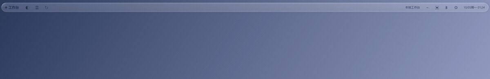
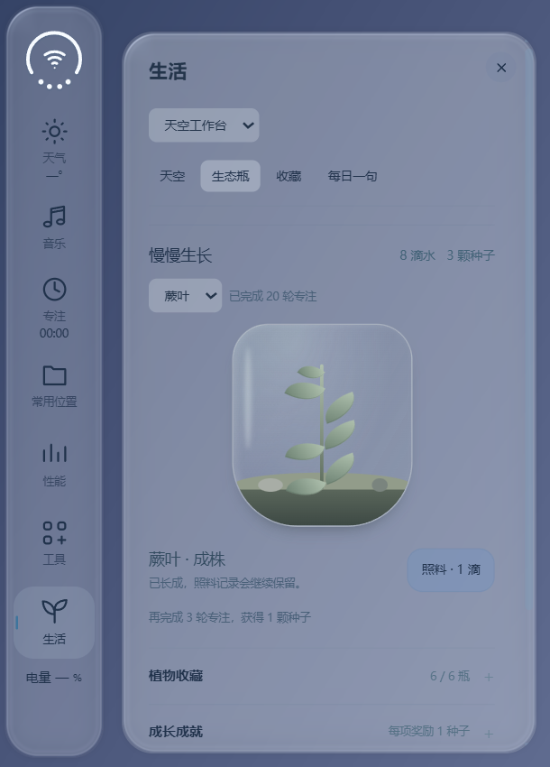
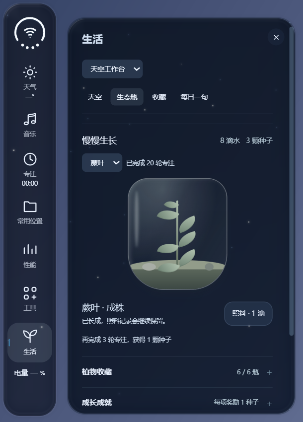
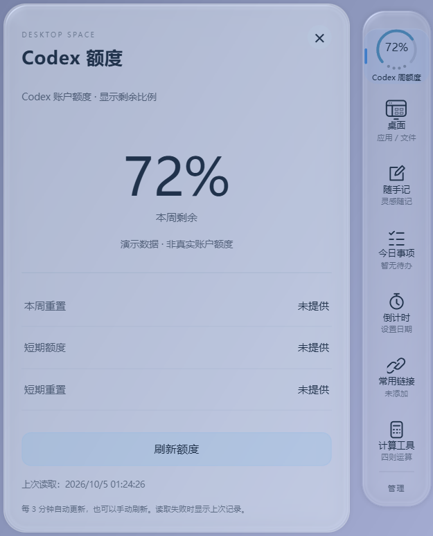
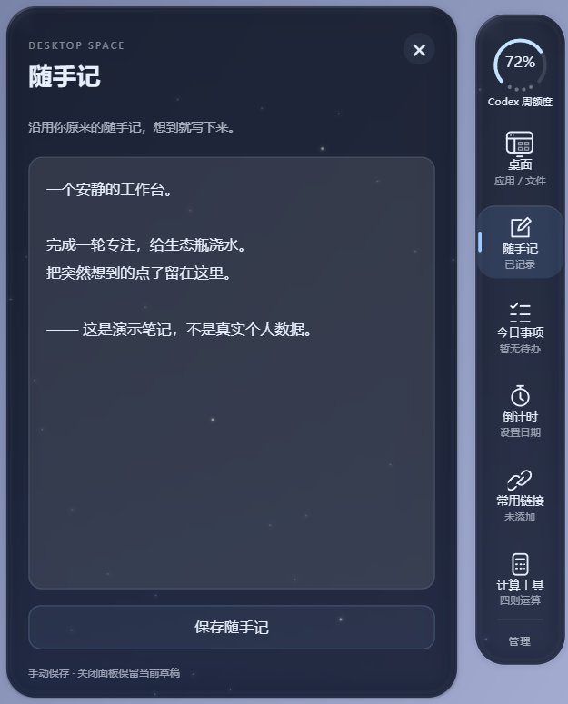
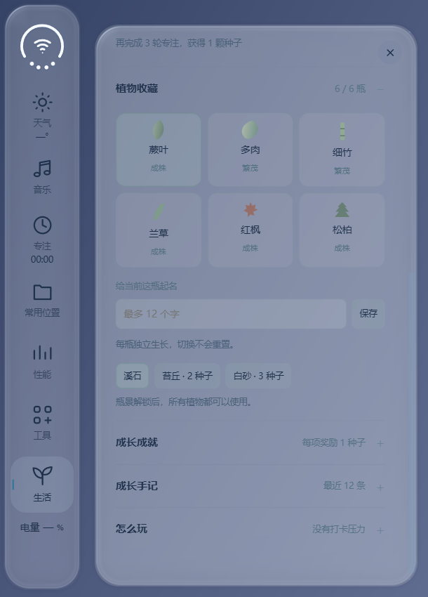
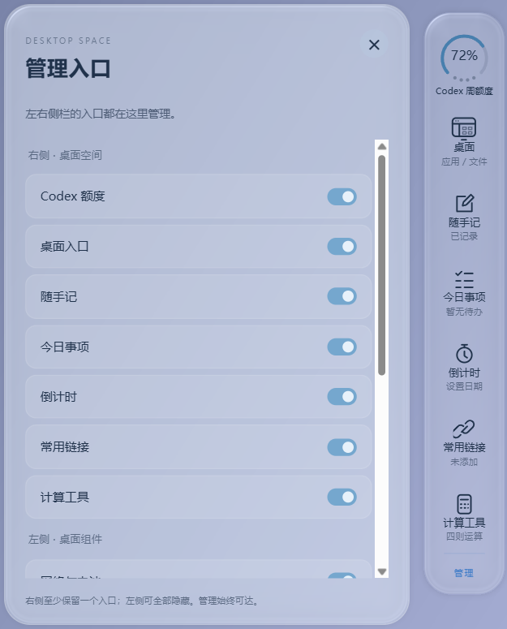

# PrismGlass Desktop

Windows 液态玻璃桌面：灵动岛式顶部栏、双侧组件、应用 Dock，以及可成长的生态瓶。

[](https://github.com/liburce0412-alt/prismglass-desktop/actions/workflows/build.yml)
[](LICENSE)


**实验性项目 / Windows x64。** 从个人长期使用的桌面方案整理而来，使用 C# WinForms + WebView2 + WebGL + Rainmeter。默认开机进入普通 Windows 桌面，美化由用户手动开启。

[看显示效果](#显示效果) · [功能](#功能) · [构建与安装](#构建与安装) · [操作速查](#操作速查) · [常见问题](#常见问题)

## 显示效果

以下均由本仓库的 **真实 WebView2 / WebGL 组件运行后采集**，不是设计概念图。为保护隐私，采集使用独立预览环境、默认渐变底图与演示数据；不代表作者的真实账户额度或个人记录，也不是整台桌面的实机录屏。

### 顶部栏 → 灵动岛 → 展开面板



点击顶部中间区域收拢，再次点击还原；按住灵动岛向下拉，展开媒体和专注控制。上面的循环演示触发同一套真实动画状态，展示形状变化；不是鼠标手势教学录屏。

[查看 MP4 演示](docs/media/top-island.mp4) · [查看展开面板原图](docs/media/top-expanded.png)

### Sky / Astro：同一套组件，两种氛围

<table>
  <tr><th>Sky · 轻透玻璃</th><th>Astro · 深色星空</th></tr>
  <tr>
    <td></td>
    <td></td>
  </tr>
</table>

两种主题保留同样的布局与操作。生态瓶会随着专注与照料成长，图中植物、滴水和种子数量均为演示存档。

### 右侧工具区：额度看板与随手记

<table>
  <tr><th>额度圆环与详情</th><th>随手记 · Astro</th></tr>
  <tr>
    <td></td>
    <td></td>
  </tr>
</table>

额度默认每三分钟更新；不可用时显示未获取。右侧同时提供桌面快捷方式、今日事项、倒计时、常用链接和计算工具，悬停查看、点击操作。

<details>
<summary><strong>更多截图：植物收藏与两侧组件管理</strong></summary>

<table>
  <tr><th>六种植物收藏</th><th>统一管理两侧入口</th></tr>
  <tr>
    <td></td>
    <td></td>
  </tr>
</table>

</details>

素材来源、演示条件与复现方法见 [效果素材说明](docs/media/README.md)。

## 功能

- **液态顶部栏**：点击中间向内聚拢，再次点击展开；按住下拉打开内容；轮廓绘制与原生裁切共用形状数据。
- **双主题**：Sky 与 Astro，保留玻璃折射、跟手渐变、形变和动态氛围。
- **左侧栏**：Wi-Fi / 电量、天气、音乐、专注、常用位置、性能、工具和生活。
- **右侧栏**：Codex 额度圆环、桌面快捷方式、随手记、今日事项、倒计时、常用链接、计算工具；支持悬停展开和统一管理。
- **生态瓶**：六种植物、独立成长、浇水、装饰、收藏、成就与日志。
- **应用 Dock**：从本机提取图标，固定应用与运行窗口，遮挡隐藏、底部边缘唤出和窗口预览。
- **可恢复桌面**：退出时恢复原生图标和任务栏；登录恢复步骤不启动美化。

任何仍可见的最大化或全屏应用覆盖主屏时，顶部和左右栏隐藏；即使切到另一个普通窗口也保持隐藏。覆盖窗口最小化、关闭或还原为不覆盖主屏的普通窗口后恢复；已隐藏和其他虚拟桌面的窗口不参与判断。底部 Dock 保留独立的边缘唤出规则。当前以主显示器为目标。

## 操作速查

| 想做什么 | 操作 |
|---|---|
| 收起顶部栏 | 点击顶部中间留白，聚拢为灵动岛 |
| 展开顶部内容 | 按住灵动岛向下拖动 |
| 恢复完整顶部栏 | 再次点击灵动岛 |
| 看侧栏内容 | 鼠标短暂停留，避免快速划过误触发 |
| 调整两侧入口 | 右侧底部进入“管理” |
| 培养生态瓶 | 左侧“生活 → 生态瓶”，完成专注获得照料资源 |
| 唤出被遮挡的 Dock | 在屏幕底边短暂停留 |
| 回到普通桌面 | 使用“退出 PrismGlass”快捷方式 |

## 依赖

- Windows 10/11 x64，.NET Framework 4.8。
- [PowerShell 7](https://github.com/PowerShell/PowerShell)、[Rainmeter](https://www.rainmeter.net/) 和 [WebView2 Evergreen Runtime](https://developer.microsoft.com/microsoft-edge/webview2/)。
- 开发构建需要 Node.js，用于 JavaScript 语法检查；编译使用 Windows .NET Framework 自带的 C# 编译器。
- 可选：官方 Codex CLI（自行安装并登录），用于读取本人额度。读取失败会显示未获取，不会伪造数字；默认每三分钟刷新。
- 可选：Python 3 与网易云音乐桥接，安装时显式启用。

## 构建与安装

在 PowerShell 7 中：

```powershell
git clone https://github.com/liburce0412-alt/prismglass-desktop.git
cd prismglass-desktop
./scripts/Test.ps1
./scripts/Build.ps1
./dist/PrismGlass/Install.ps1 -Latitude 31.23 -Longitude 121.47
```

构建会从 NuGet 下载固定版本 WebView2 SDK，不从开发者机器拷贝运行环境。安装器默认写入 `%LOCALAPPDATA%\PrismGlass`，Rainmeter 皮肤写入“文档\Rainmeter\Skins\PrismGlass”。已存在安装或同名皮肤时会停止，避免覆盖个人设置；目前没有自动迁移／覆盖升级器。

Rainmeter 在非标准目录时传入 `-RainmeterPath '你的路径\Rainmeter.exe'`。天气坐标是参数，默认是伦敦示例位置；请按需要设置。选择 `-EnableMusicBridge` 才会启用网易云音乐信息读取。要仅准备文件、不改桌面和启动项，传 `-PrepareOnly -Destination '一个新的空目录'`。

安装后使用桌面快捷方式“开启 PrismGlass”和“退出 PrismGlass”。登录项只恢复普通桌面，不加载美化。安装器不会立即开启美化，也不会修改壁纸。

当前版本使用默认“文档\Rainmeter\Skins”目录；自定义 Rainmeter SkinPath 的用户需要自行适配。不要同时运行另一套 PrismGlass 实例。

## 配置与退出

- 在右侧“管理”中控制两侧组件；笔记、事项、生态瓶进度保存在安装目录中。
- 固定应用配置在 `LiquidDesktop/pins.json`，安装时生成“文件、记事本”两个通用入口；应用路径和图标从用户自己的电脑获取。
- 顶部刷新功能采样本机当前静态壁纸作为玻璃底图；仅在本地使用，不上传壁纸。
- 若组件异常，运行 `pwsh -File '<安装目录>\DesktopMode.ps1' -Mode Recovery` 恢复原生桌面。
- 卸载前先退出美化，再备份安装目录中的个人数据，移除 PrismGlass 安装目录、对应 Rainmeter 皮肤和两个桌面快捷方式，以及启动文件夹中的 `PrismGlass - Restore ordinary desktop.lnk`。

## 隐私与依赖边界

此仓库包含白名单源码、皮肤模板、测试、文档及使用独立演示数据采集的效果素材。**不包含**作者的账号、Cookie、WebView2 用户目录、额度缓存、个人应用列表、真实笔记、私人桌面截图、游戏图标、音乐封面或原始壁纸。

运行时的本地数据和网络请求见 [隐私说明](docs/PRIVACY.md)。第三方依赖及参考见 [第三方声明](THIRD-PARTY-NOTICES.md)。MIT 许可证适用于本仓库自有代码；第三方程序、品牌与素材不由此重新授权。

## 验证范围

自动检查覆盖 Dock 隐藏／唤出策略、最大化／全屏识别、跨屏排除、JavaScript 与 PowerShell 语法；CI 在 Windows 上构建。通过编译不代表已验证所有显卡、DPI、显示器布局或真实重启。当前公开版仍需更多不同机器的实际测试。

## 常见问题

**为什么我的玻璃底色与截图不同？** 玻璃使用本机壁纸采样，主题、壁纸、DPI 和显示器都会影响观感。仓库素材使用默认渐变底图，不包含作者原始壁纸。

**没有 Codex 账号可以使用吗？** 可以，桌面主体不依赖 Codex。额度组件需要自行安装并登录官方 CLI，其他组件可独立使用。

**开机会自动开启美化吗？** 不会。登录步骤只恢复普通 Windows 桌面，美化由你手动开启。

**截图就是安装后的完整桌面吗？** 不是。截图是公开代码的真实组件预览，用演示数据展示细节；当前没有把作者的私人桌面整体录屏公开。

## 目录

```text
src/LiquidDesktop/  原生窗口、数据和 WebGL/HTML 界面
rainmeter/          Rainmeter 配置模板和 Lua 数据桥
scripts/           构建、安装、恢复与检查
tests/             行为回归测试
licenses/          第三方许可文本
```

欢迎通过 Issues 提交复现步骤、Windows 版本、DPI、显示器布局及经过脱敏的画面。

### macOS 风格鼠标
开启美化时临时替换系统指针，包括箭头、链接手形、文本选择、缩放和等待动画；退出或登录恢复时重新加载原来的 Windows 指针主题。右侧栏 → 管理 → 鼠标大小可选择 75%、100%、125%、150%、200%，应用后记住选择；退出美化恢复原 Windows 指针样式和大小，下次开启再应用美化大小。不会改写已保存的指针设置，也不增加常驻进程。素材来自 [antiden/macOS-cursors-for-Windows](https://github.com/antiden/macOS-cursors-for-Windows)，遵循 MIT 许可。
